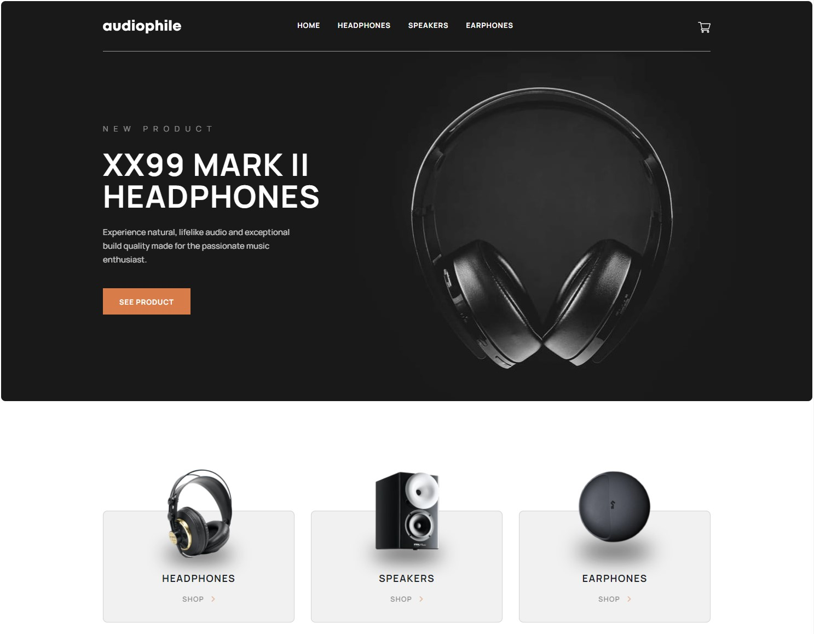

# Frontend Mentor - Audiophile e-commerce website solution

This is a solution to the [Audiophile e-commerce website challenge on Frontend Mentor](https://www.frontendmentor.io/challenges/audiophile-ecommerce-website-C8cuSd_wx). An e-commerce website using WordPress and React (> Frontity).

## Table of contents

- [Overview](#overview)
  - [The challenge](#the-challenge)
  - [Screenshot](#screenshot)
  - [Links](#links)
- [My process](#my-process)
  - [Built with](#built-with)
  - [What I learned](#what-i-learned)
  - [Continued development](#continued-development)
  - [Useful resources](#useful-resources)
- [Author](#author)
- [Acknowledgments](#acknowledgments)

## Overview

### The challenge

Users should be able to:

- View the optimal layout for the app depending on their device's screen size
- See hover states for all interactive elements on the page
- Add/Remove products from the cart
- Edit product quantities in the cart
- Fill in all fields in the checkout
- Receive form validations if fields are missed or incorrect during checkout
- See correct checkout totals depending on the products in the cart
  - Shipping always adds $50 to the order
  - VAT is calculated as 20% of the product total, excluding shipping
- See an order confirmation modal after checking out with an order summary
- **Bonus**: Keep track of what's in the cart, even after refreshing the browser (`localStorage` could be used for this if you're not building out a full-stack app)

### Screenshot



### Links

- Solution URL: [www.frontendmentor.io/MartinEichinger](https://www.frontendmentor.io/solutions/responsive-ecommerce-website-with-react-and-wordpress-BJJ_X1RG9)
- Live Site URL: [www.audiophile-ecom-frontend.vercel.app](https://audiophile-ecom-frontend.vercel.app/)

## My process

### Built with

- Semantic HTML5 markup
- CSS custom properties
- Flexbox
- Bootstrap
- Responsive design
- [React](https://reactjs.org/) - JS library
- [Frontity](https://frontity.org/) - React / WordPress framework
- [Styled Components](https://styled-components.com/) - For styles
- [Wordpress](https://wordpress.org/) - Headless CMS

### What I learned

For this project I used React as frontend and WordPress as headless CMS for the first time. Together with that I also introduced myself to styled components.

### Continued development

...

### Useful resources

- [Frontity website](https://frontity.org/) - This helped me for getting introduced to frontity framework.
- [Bootstrap website](https://getbootstrap.com/) - This helped to look up the individual functions from bootstrap.

## Author

- Website - [EdMadd profile page](https://www.profilepage.edmadd.eu)
- Frontend Mentor - [@MartinEichinger](https://www.frontendmentor.io/profile/MartinEichinger)

## Acknowledgments

This is where you can give a hat tip to anyone who helped you out on this project. Perhaps you worked in a team or got some inspiration from someone else's solution. This is the perfect place to give them some credit.

```html
<h1>Some HTML code I'm proud of</h1>
```

```css
.proud-of-this-css {
  color: papayawhip;
}
```

```js
const proudOfThisFunc = () => {
  console.log("🎉");
};
```
